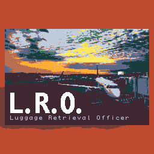

## To Do List

+ Make an Options Menu
    + Brightness
    + Reset Level Progress
    + Replay Tutorial
    + Credits
+ Main Menu
+ Add sound effects
+ Add music
+ Colour Blind Mode

## What if there was?

+ A block that could rotate? Becoming a horizontal or a vertical block?
+ A block that could only be slid along the whole way
+ A block that could change sizes?
+ A time limit
+ A move counter

## Puzzle Source

http://mathsonline.org/game/jam.html?2
